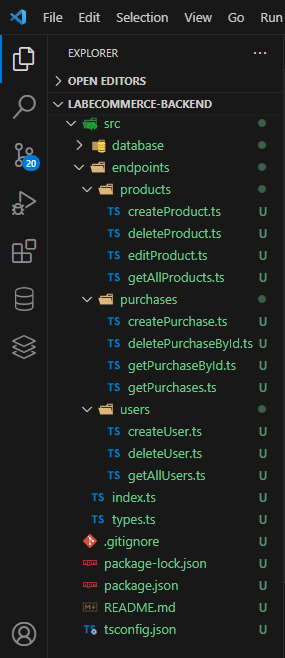

# Labecommerce

### A API Labecommerce configura o primeiro projeto em Backend pela Labenu. O projeto consiste em um banco de dados que contém tabelas de usuários, produtos e compras. As tabelas foram desenvolvidas através do SQLITE 3, utilizando, no que tange aos arquivos TypeScript, recursos de Knex para estabelecer conexão entre as linguagens.

# Índice
* [Layout](#Layout)
* [Requisições (Paths)](#Requisições)
* [Exemplo de Requisições](#exemplo-de-requisições)
* [Documentação](#documentação)
* [Tecnologias](#tecnologias)
* [Acesso ao Projeto](#acesso-ao-projeto)

# Layout

* Estrutura das pastas



# Requisições

### Requisições de usuários

* /users

### Requisições de produtos

* /products

### Requisições de compras

* /purchases


# Exemplos de requisições
### Requisições de usuários


* `GET /users`: Retorna todos usuários.
```json
[
    {
        "id": "u001",
        "name": "Bob Dylan",
        "email": "mrtambourineman@gmail.com",
        "password": "zimmerman",
        "created_at": "2023-07-17 11:37:22"
    },
    {
        "id": "u002",
        "name": "John Lennon",
        "email": "thewalrus@applerecords.com",
        "password": "strawberry",
        "created_at": "2023-07-17 11:37:22"
    },
    {
        "id": "u003",
        "name": "Alfred Hitchcock",
        "email": "masterofsuspense@uol.com.br",
        "password": "blondes",
        "created_at": "2023-07-17 11:37:22"
    },
    {
        "id": "u014",
        "name": "roger federer",
        "email": "rogederer@bol.com.br",
        "password": "1456",
        "created_at": "2023-07-17 11:44:23"
    }
]
```

* `POST /users`: Registra um novo usuário.

```json
{
  "message": "Usuário cadastrado."
}
```

### Requisições de produtos
* `GET /products`: Retorna todos os produtos se não houver preenchimento de query params.
```json
[
    {
        "id": "p001",
        "name": "Camiseta Gamer",
        "price": 29.99,
        "description": "Camiseta de algodão de alta qualidade",
        "image_url": "https://example.com/camiseta.jpg"
    },
    {
        "id": "p002",
        "name": "Calça de Mármore",
        "price": 79.99,
        "description": "Calça jeans moderna e confortável",
        "image_url": "https://example.com/calca-jeans.jpg"
    },
    {
        "id": "p003",
        "name": "sapato confortável",
        "price": 99.99,
        "description": "sapato de última geração",
        "image_url": "https://example.com/tenis-casualjpg"
    },
    {
        "id": "p005",
        "name": "Patinete Caseiro",
        "price": 49.99,
        "description": "Patinete para transitar entre os cômodos da casa",
        "image_url": "https://example.com/patinete.jpg"
    }
]

```

* Exemplo de retorno usando query params (?name=camiseta): 

```json
[
    {
        "id": "p001",
        "name": "Camiseta Gamer",
        "price": 29.99,
        "description": "Camiseta de algodão de alta qualidade",
        "image_url": "https://example.com/camiseta.jpg"
    }
]
```


* `POST /products`: Cadastra um novo produto.
```json
{
    "message": "Produto adicionado."
}
```
* `PUT /products/:id`: Edição de produtos por ID.
```json
{
    "message": "Atualização realizada com sucesso"
}
```

### Requisições de compras

* `GET /purchases/:id`: Pesquisa de compra por ID.
```json
{
    "purchase_id": "o003",
    "totalPrice": 20,
    "createdAt": "2023-07-17 11:38:07",
    "buyerId": "u001",
    "buyerName": "Bob Dylan",
    "buyerEmail": "mrtambourineman@gmail.com",
    "products": [
        {
            "id": "p003",
            "name": "sapato confortável",
            "price": 99.99,
            "description": "sapato de última geração",
            "image_url": "https://example.com/tenis-casualjpg"
        }
    ]
}
```

* `POST /purchases`: Criação de pedido.
```json
{
    "message": "Pedido cadastrado com sucesso."
}
```
* `DELETE /purchases/:id`: Deleção de conta por ID.

```json
{
    "message": "Pedido cancelado."
}
```

# Documentação

A documentação está disponibilizada no [Postman](https://documenter.getpostman.com/view/26594705/2s946h7BVd).

# Tecnologias

As ferramentas a seguir possibilitaram a construção do projeto:

- [SQLite](https://www.sqlite.org/docs.html)
- [Node.js](https://nodejs.org/en/)
- [TypeScript](https://www.typescriptlang.org/)
- [SQL](https://learn.microsoft.com/pt-br/sql/?view=sql-server-ver16)
- [Knex.js](https://knexjs.org/guide/)
- [Express](https://expressjs.com/pt-br/)


# Acesso ao projeto

### Requisitos

A instalação das ferramentas [Git](https://git-scm.com) e [Node.js](https://nodejs.org/en/) é fundamental para a execução do código. 

As etapas abaixo dão sequência a configuração:

```bash
# Clone o repositório.
$ git clone <https://github.com/wangunderline/labecommerce-backend.git>

# Instale as dependências.
$ npm install

# Execute a aplicação.
$ npm run dev

# O servidor se estabelecerá por padrão na porta 3003. O acesso pode ser obtido diretamente pelo navegador através de <http://localhost:3003>, ou via Postman.
```


